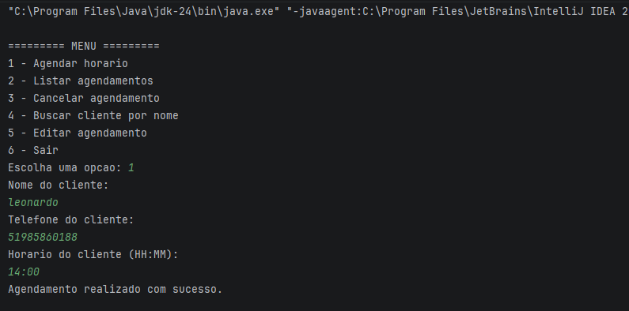
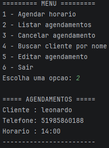
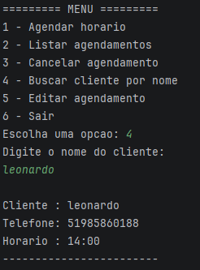
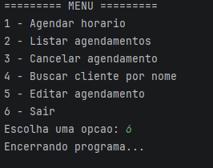

# 💈 Sistema de Agendamento para Barbearia

🚀 **Demonstração do sistema no final deste README (com imagens reais funcionando)**

Sistema desenvolvido em Java com foco em prática de programação orientada a objetos (POO), simulação de sistema real e organização de código.

---

## 🚀 Funcionalidades

* Cadastro e busca de clientes
* Agendamento de horários
* Listagem de agendamentos
* Edição e cancelamento de horários
* Validação de horários no formato HH:MM
* Permissão apenas de horários com minutos 00 ou 30
* Prevenção de horários duplicados
* Persistência de dados em arquivo `.txt`
* Carregamento automático dos dados ao iniciar o sistema

---

## 🧠 Tecnologias utilizadas

* Java
* Programação Orientada a Objetos (POO)
* ArrayList
* Scanner
* FileWriter / PrintWriter
* Leitura de arquivos com Scanner

---

## 🏗️ Estrutura do projeto

* `Main.java` → Menu principal e fluxo do sistema
* `SistemaAgendamento.java` → Regras de negócio
* `Cliente.java` → Modelagem de cliente
* `Agendamento.java` → Modelagem de agendamento

---

## ▶️ Como executar

1. Compile os arquivos `.java`
2. Execute a classe `Main`
3. Utilize o menu interativo no terminal

---

## ⏰ Exemplos de horários válidos

* 08:00
* 08:30
* 14:00
* 18:30

## ❌ Exemplos de horários inválidos

* 8:00
* 14:15
* 99:99
* abcde

---

## 🎯 Objetivo do projeto

Este projeto foi desenvolvido para consolidar conhecimentos em Java, com foco em lógica de programação, estruturação de código e simulação de um sistema utilizado no mundo real.

---

## 📌 Melhorias futuras

* Interface gráfica
* Versão web acessível para clientes
* Integração com banco de dados
* Painel administrativo para o barbeiro
* Seleção de serviços (corte, barba, etc)
* Controle por data (agenda completa)

---

## 📸 Demonstração

### 📝 Agendamento de horário

### 📋 Listagem de agendamentos

### 🔍 Busca de cliente

### 🚪 Encerramento do sistema

---

## 👨‍💻 Autor

Leonardo Sironi da Rosa
